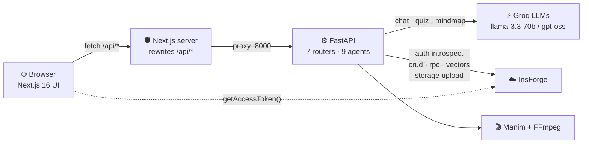

<div align="center">

# 🎓 Dronacharya v3

### AI-Powered NCERT Tutor — Knowledge Galaxy · Voice Tutor · Auto-Generated Video Lessons

**FastAPI · Next.js 16 · Groq (LLaMA / GPT-OSS) · InsForge (Postgres + pgvector + Auth + Storage) · Manim**

[](https://fastapi.tiangolo.com)
[](https://nextjs.org)
[](https://groq.com)
[](https://insforge.dev)
[](#-authentication-model)
[](backend/app/video_generator)

</div>

---

## 📖 What is this?

Dronacharya is an **AI tutor platform for NCERT students**. Type any topic and the app:

- 🧠 **Maps the whole topic** into an interactive *Knowledge Galaxy* — a ReactFlow mindmap where every subtopic node opens details, key points, quizzes and its own generated explainer video.
- 💬 **Answers questions like a patient teacher** in a voice-enabled AI chat grounded in your own ingested study material (RAG over pgvector).
- 🃏 **Drills you automatically** — quizzes with hints & explanations, flip-flashcards, spaced-repetition *Boss Fights*.
- 🎭 **Roleplays exam scenarios** — viva-style practice driven by a scenario agent.
- 🎬 **Turns subtopics into watchable lessons** — a multi-agent pipeline plans scenes, writes Python/Manim code, renders animations and uploads them to object storage.
- 🏆 **Tracks your growth** — XP, levels, daily streaks and study-time analytics per user.

Everything stateful lives in **InsForge**: Postgres tables + `pgvector` embeddings, session auth, and media buckets. No MongoDB, no Clerk — the backend was fully migrated (see [docs/MIGRATION_INSFORGE.md](docs/MIGRATION_INSFORGE.md)).

---

## ✨ Feature → Code Map

| Feature | What it does | Where |
|---|---|---|
| 🧠 Knowledge Galaxy | LLM-generated ReactFlow mindmaps w/ per-node videos | `backend/app/agents/mindmap_agent.py` · `frontend/components/ChapterMindmap.tsx` |
| 💬 AI Tutor chat | RAG-grounded conversational tutor + TTS voice replies | `agents/tutor_agent.py` · `services/vector_store.py` |
| 🎯 Quiz & Flashcards & SRS | Auto-generated drills + Boss Fight scheduling | `agents/quiz_agent.py`, `flashcard_agent.py` |
| 🎭 Scenario training | Viva/interview roleplay with scoring | `agents/scenario_agent.py` |
| 🎬 Video engine | Scene planner → Manim coder → renderer → uploader | `backend/app/video_generator/` |
| 📚 Smart Ingest | YouTube/PDF/doc ingestion → chunked pgvector embeddings | `routers/ingest.py` |
| 🏆 Gamification | XP/level/streak/study-time on InsForge Postgres | `services/user_service.py` · `public.user_stats` |

---

## 🏗 Architecture



**Single-container deployment** (Hugging Face): the browser only ever talks to one origin. `/api/*`, `/videos/*` and `/keyframes/*` are proxied by `frontend/next.config.ts` to a loopback uvicorn — zero CORS surface.

---

## 🚀 Quick Start (local)

```bash
git clone https://github.com/PiyushBorban49/drona.git && cd drona

# ── 1) Backend ──────────────────────────────────────────────
cd backend
cp .env.example .env        # then fill in your keys (table below)
pip install -r requirements.txt
uvicorn app.main:app --reload --port 8000

# ── 2) Frontend (new terminal) ──────────────────────────────
cd ../frontend
cp .env.example .env.local  # includes NEXT_PUBLIC_API_URL=http://localhost:8000
npm install
npm run dev                 # http://localhost:3000
```

> ⚠️ Local dev **requires** `NEXT_PUBLIC_API_URL=http://localhost:8000` in `frontend/.env.local`.
> If that variable is absent, the frontend switches to same-origin `/api` mode meant for containers.

---

## 🔐 Environment Variables

**`backend/.env`**

| Variable | Required | Purpose |
|---|---|---|
| `INSFORGE_URL` | ✅ | Project REST base (`https://<appkey>.us-east.insforge.app`) |
| `INSFORGE_API_KEY` | ✅ | Server-side admin key (auth introspection, DB, storage) |
| `GROQ_API_KEY` | ✅ | All AI agents (chat/quiz/mindmap/planner/coder) |
| `GROQ_MODEL` | – | Default `llama-3.3-70b-versatile`. ⚠️ reasoning models (`openai/gpt-oss-*`) are supported but auto-throttled — see [troubleshooting](docs/TROUBLESHOOTING.md#413-tokens-per-minute) |
| `GOOGLE_API_KEY` | optional | Gemini video-coder path + default planner |
| `MUX_TOKEN_ID` / `MUX_SECRET_KEY` | optional | Managed streaming instead of bucket playback |
| `TAVILY_API_KEY` | optional | Web-search agent |
| `VIDEO_BUCKET` / `KEYFRAME_BUCKET` | – | Storage buckets (default `videos` / `keyframes`) |

**`frontend/.env.local`**

| Variable | Required | Purpose |
|---|---|---|
| `NEXT_PUBLIC_INSFORGE_URL` | ✅ | Browser SDK talks straight to InsForge Auth |
| `NEXT_PUBLIC_INSFORGE_ANON_KEY` | ✅ | Public anon key |
| `NEXT_PUBLIC_API_URL` | local dev | Absolute FastAPI URL; unset ⇒ container proxy mode |

---

## ☁️ Deploy on Hugging Face Spaces

| Path | HF compute | What you get |
|---|---|---|
| 🟢 **Option A — Gradio SDK Space** (recommended) | **FREE** | Backend API + 🎓 `/app` control panel; run the UI locally or anywhere |
| 🐳 Option B — Docker Space (full stack) | paid | Entire product behind one `*.hf.space` URL |

```bash
# FREE backend path — one command (stages clean tree + pre-push import check):
hf auth login                                       # once
./scripts/deploy_backend_space.sh <you>/drona-backend
# then on the Space set Secrets  GROQ_API_KEY · INSFORGE_URL · INSFORGE_API_KEY
#           and Variable  CORS_ORIGINS=["http://localhost:3000"]
# and in frontend/.env.local → NEXT_PUBLIC_API_URL=https://<you>-drona-backend.hf.space
```

All walkthroughs (free & docker paths, split hosting, persistence, CORS matrix): **[docs/DEPLOYMENT_HF.md](docs/DEPLOYMENT_HF.md)**

---

## 🧠 The Agents

| Endpoint | Agent | Model behaviour |
|---|---|---|
| `POST /chat` | `tutor_agent` | Streams tutor answers; falls back gracefully when RAG context is empty |
| `POST /mindmap` | `mindmap_agent` | JSON output → normalized ReactFlow graph; retries with strict prompt; rescues empty-content reasoning models; deterministic offline fallback so the canvas never blanks |
| `POST /quiz` · `/flashcards` | `quiz_agent` · `flashcard_agent` | Strict JSON schemas validated before hitting the client |
| `POST /scenario/start` · `/respond` | `scenario_agent` | Multi-turn viva simulation with difficulty escalation |
| `POST /video/generate-subtopic` | `planner` + `generator` + `post_processor` | Scene JSON → per-scene Manim code → render → concat → upload to bucket |
| `POST /ingest/*` | document ingestion | Chunk → embed via InsForge gateway (`text-embedding-3-small`) → store in `workspace_embeddings` |

---

## 🗄 Data Model (InsForge Postgres)

| Object | Kind | Contents |
|---|---|---|
| `auth.users` | managed | Signups, email verification, sessions (15-min access tokens) |
| `public.user_stats` | table | XP, level, streak, hours, continue-learning JSON — owner-only RLS |
| `public.workspace_embeddings` | table | pgvector `vector(1536)` chunks + HNSW index |
| `match_workspace_chunks` | RPC | Cosine top-k retrieval used by every RAG agent |
| `videos` / `keyframes` | buckets | Generated lesson media, public URLs |

Schema & migrations live in [`migrations/`](migrations/).

---

## 🛡 Authentication model

1. Browser signs up/logs in via `@insforge/sdk` against InsForge Auth.
2. Every API call carries `Authorization: Bearer <accessToken>` (attached centrally in `lib/api.ts`).
3. FastAPI dependency `get_current_user` introspects the token (cached ≤5 min) — identity comes from the token, never from request bodies.

---

## 📂 Project Structure

```
drona/
├── backend/
│   ├── app/
│   │   ├── agents/          # tutor · mindmap · quiz · flashcard · scenario …
│   │   ├── routers/         # chat · content · video · curriculum · ingest · user
│   │   ├── services/        # insforge_client · auth · vector_store · user_service · tts · mux
│   │   ├── video_generator/ # planner → generator → post_processor (Manim pipeline)
│   │   ├── schemas/models.py
│   │   ├── config.py        # pydantic-settings (env contract)
│   │   └── main.py
│   ├── media/               # generated videos/keyframes/audio (ephemeral on HF)
│   └── requirements.txt
├── frontend/
│   ├── app/dashboard/       # explorer · chat · quiz · flashcards · scenario · video · profile
│   ├── components/          # ChapterMindmap · VideoPlayer · SmartImportModal …
│   ├── lib/api.ts           # single fetchAPI client (same-origin aware)
│   ├── lib/insforge.ts      # browser SDK singleton
│   └── context/AuthContext.tsx
├── migrations/              # SQL applied to InsForge project
├── docs/                    # ← deep-dives (architecture · migration · troubleshooting · deploy)
├── start.sh                 # container entrypoint (uvicorn + next start)
└── Dockerfile               # HF-Spaces-ready full-stack image
```

---

## 🧰 Troubleshooting — the highlight reel

Every failure we've ever hit in production & dev is catalogued with root cause + fix in **[docs/TROUBLESHOOTING.md](docs/TROUBLESHOOTING.md)**. Three classics:

| Symptom | Root cause | Fix |
|---|---|---|
| `503 Auth service unavailable` | Empty `INSFORGE_URL`/key env vars | Fill `backend/.env`, restart |
| `[mindmap] EMPTY response` ×2 | Reasoning model returns analysis in hidden field | Pull latest — agent probes the reasoning buffer + uses non-reasoning default |
| `413 Requested 8527 > Limit 8000 TPM` | Groq bills TPM as prompt+max_tokens | Adaptive completion budget shipped in current code |

---

## 🔄 Version Highlights

- **v3.1** — HF full-stack Dockerfile · same-origin `/api` gateway · offline fallback mindmap · reasoning-model resilience · TPM-aware budgets · this documentation suite
- **v3.0** — complete migration off MongoDB & Clerk onto **InsForge** (Auth + Postgres/pgvector + Storage); JWT-only identity; minted `user_stats`; HNSW pgvector retrieval

---

<div align="center">

Built with ❤️ by **[@PiyushBorban49](https://github.com/PiyushBorban49)** · Backend powered by [InsForge](https://insforge.dev) · Models by [Groq](https://groq.com)

</div>
